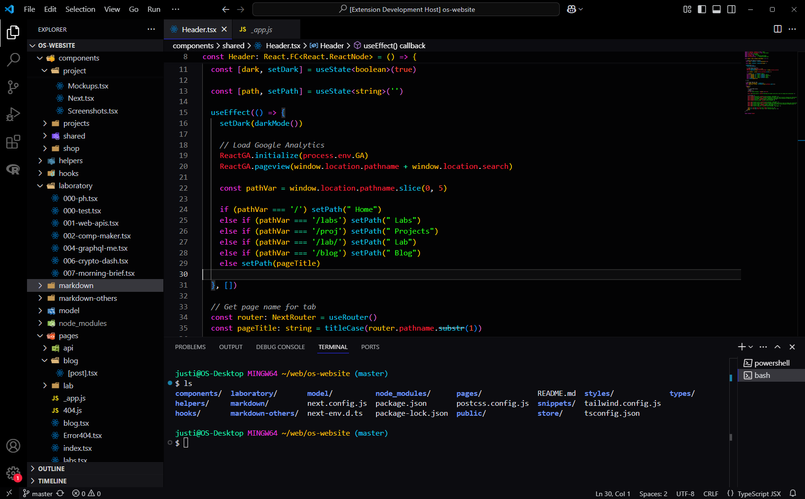
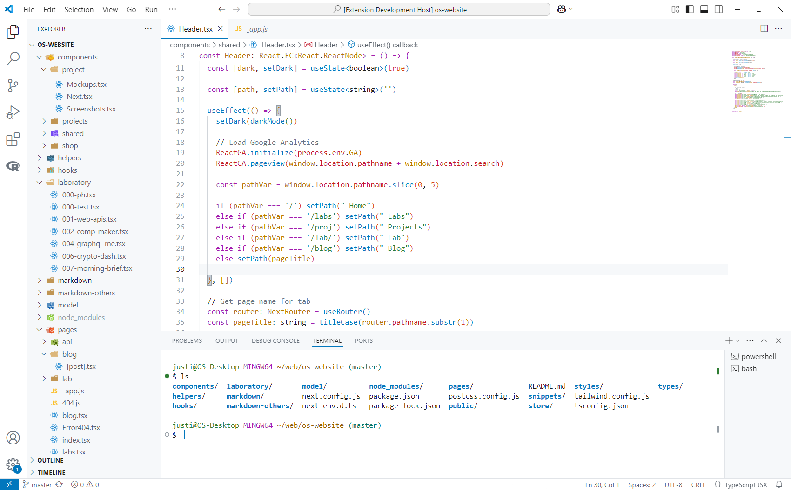

# odd scenes vscode theme

High contrast theme for VSCode. Includes all UI sections and components.

### Dark Mode

### Light Mode

## Installation

- Search in VSCode extensions marketplace
- Click install
- `ctrl/cmd + shift + p` -> Preferences: Color Theme
- Select color theme

## For more information

* [Visual Studio Code's Markdown Support](http://code.visualstudio.com/docs/languages/markdown)
* [Markdown Syntax Reference](https://help.github.com/articles/markdown-basics/)

